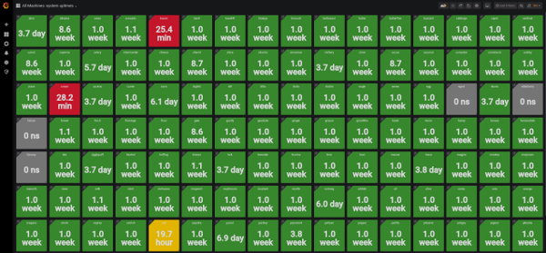

# labMonitoring
monitoring lab machines and servers with zabbix and grafana

We have around 20 servers, 150 lab machines, 10 printers, and a network
switch. We would like to create *status dashboards* to easily show the
current status of our systems. These dashboards should be accessible by the
sysadmins as well as the students and faculty. Ideally, the dashboards
will help the sysadmins discover and diagnose problems, and help the
students and faculty to better utilize the department resources.

Here are two quick examples of the dashboards we will create:

We will use [zabbix](https://www.zabbix.com/manuals) to gather 
the data from the lab machines and servers, and
[grafana](https://grafana.com/) to turn the gathered data into
useful dashboards.

## install zabbix

## install grafana

## set up monitoring and dashboards
