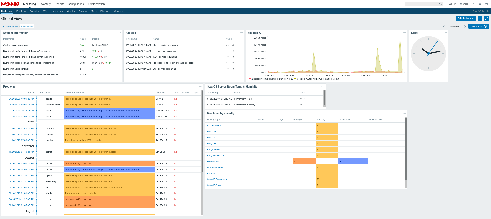

# monitoring lab computers and servers with zabbix and grafana

We have around 20 servers, 150 lab computers, 10 printers, and a network
switch. We would like to create *status dashboards* to easily show the
current status of our systems. These dashboards should be accessible by the
sysadmins as well as the students and faculty. Ideally, the dashboards
will help the sysadmins discover and diagnose problems, and help the
students and faculty to better utilize the department resources.

Here are two quick examples of the dashboards we will create:


The above shows CPU load vs. time for all of our lab computers and
servers. Additionally, clicking in the upper-left corner of any graph
takes you to a more detailed status page for that particular computer
(see below).


This grafana dashboard uses the 
[Singlestat Math Panel](https://grafana.com/grafana/plugins/blackmirror1-singlestat-math-panel)
to show *uptimes* for all lab computers. Additionally, thresholds are set
to color the panels grey (host down), red (host just came up), yellow (up
for less than a day), or green. These panels also include links to 
more detailed dashboard status pages for each computer, like this:


We will use [zabbix](https://www.zabbix.com/manuals) to gather 
the data from the lab computers and servers, and
[grafana](https://grafana.com/) to turn the gathered data into
useful dashboards.

Note: as of June 2021, this works for Zabbix v5.4 and Grafana v8.0.3
(on Debian 10).

## install zabbix

### preliminaries

For our install (updated Summer 2021) we used debian buster on a virtual
machine for the zabbix server, running version 5.4 of zabbix.

Here's the Zabbix System Information panel to show about how many things
(hosts, items, etc) we are monitoring:


For our virtual machine, we are using qemu-kvm, also running on a debian
stretch machine. The kvm host machine has 64GB of memory and 8 CPU
cores, and runs a few other virtual machines for us.

For the actual zabbix server, our virtual machine has 24GB of memory,
4 virtual CPUs, and 31GB of disk space. The memory is probably way
over-provisioned. We are currently using much less than that (output 
from `top` command):

    KiB Mem : 24694224 total,  8368976 free,   786036 used, 15539212 buff/cache
    KiB Swap:  2097148 total,  2097148 free,        0 used. 23273784 avail Mem

And our disk space currently looks like this:

    Filesystem      Size  Used Avail Use% Mounted on
    /dev/sda1        24G   18G  4.4G  81% /
    /dev/sda6       3.9G  2.2G  1.6G  59% /usr
    /dev/sda5       575M  932K  562M   1% /tmp

Of the 18GB used in `/`, almost all of that is in `/var/lib/mysql` where
the data is stored.

### install details

Both zabbix (v5.4) and grafana were installed from their respective
repositories. See below for pages to follow.

#### install zabbix and mysql

Follow this page for install and configuration:
[https://www.zabbix.com/download?zabbix=5.4&os_distribution=debian&os_version=10_buster&db=mysql&ws=apache](https://www.zabbix.com/download?zabbix=5.4&os_distribution=debian&os_version=10_buster&db=mysql&ws=apache)

Note: for the above, after installing (step b) but before creating the 
mysql database (step c), I followed this page on making mysql a little
more secure:

[https://www.digitalocean.com/community/tutorials/how-to-install-mariadb-on-debian-10](https://www.digitalocean.com/community/tutorials/how-to-install-mariadb-on-debian-10)

- installed mariadb-server
- ran the `mysql_secure_installation` script
- left the root password blank
- said Yes to other defaults
- set up an admin account with password
- tested access with `mysqladmin -u admin -p version`

Also note: for the mysql password for the zabbix user, if you make 
the password (in step c) 'passwords are cool', then in `zabbix_server.conf` (step d)
you can put the password in without quotes: `DBPassword=passwords are cool`

#### install apache and certbot/letsencrypt

- make sure firewall allows http and https to zabbix server
- add the certbot packages

    sudo apt-get update
    sudo apt-get install apache2 certbot python-certbot-apache 

- set it up for apache: `sudo certbot --apache`
  * provide FQDN for domain name
  * select "redirect all requests to HTTPS"


#### configure zabbix front end

Once you have https working, you can log in to the zabbix frontend.

Follow this page for frontend install and config:
[https://www.zabbix.com/documentation/current/manual/installation/frontend](https://www.zabbix.com/documentation/current/manual/installation/frontend)

- change the Admin password from `zabbix` to something better
- add users, with superAdmin permissions (blue `Create` user button top right)
- disabled the Admin user (and guest) after successful login as non-admin
- set up media: 
  * Email to use our mail server 
  * disable others??
  * Set up SMS script??
  * Set up slack webhook??

Change CacheSize=64M in zabbix_server.conf

#### additional packages on server

Some additional packages installed on the zabbix server:

- bind9-host
- mariadb-client
- nmap
- tmux
- zsh
- python3-pip
- software-properties-common

Also used `pip3` to install some python packages, which we will use when
we add hosts to zabbix.

    pip3 install pyzabbix
    pip3 install click

- pyzabbix: [https://github.com/lukecyca/pyzabbix](https://github.com/lukecyca/pyzabbix)
- click: [https://palletsprojects.com/p/click/](https://palletsprojects.com/p/click/)

#### additional configs

In `zabbix_agentd.conf`, if you want to write and run your own commands 
on your lab computers, you may need to _enable remote commands_:

    EnableRemoteCommands=1

You also may need to set the `Server` variables:

    Server=127.0.0.1,1.2.3.4            # change 1.2.3.4 to your zabbix server IP
    ServerActive=127.0.0.1,1.2.3.4


### zabbix adding hosts and items

#### make Host groups

- Configuration
- Host groups
- Create host group (blue button top right)

These host groups are just "logical groups" that are used for filtering.
Initially create a bunch of empty groups, however you want to group
your computers. Then (below) we will add computers to zabbix and populate
the groups.

I created a group for each lab (room) we have (e.g., Lab238, Lab240, etc), 
as well as a group for servers, virtual machines, 
printers, special computers (with good GPUs), and networking equipment.

#### adding Hosts

```bash
$ ./addZabbixHosts.py -f /usr/swat/db/hosts.overflow -g "Lab_238" -g "SwatCSComputers" -t "Linux by Zabbix agent" -t "SSH Service" -t "ICMP Ping"
Creating cayenne in zabbix...
Creating coconut in zabbix...
Creating egg in zabbix...
Creating horseradish in zabbix...
Creating lavender in zabbix...
Creating marjoram in zabbix...
Creating molasses in zabbix...
Creating olive in zabbix...
Creating orange in zabbix...
Creating perilla in zabbix...
Creating sumac in zabbix...
Creating tamarind in zabbix...
```

We are a small computer science department that has labs of
10-30 computers in the building and around campus. When adding hosts to
zabbix, we wanted to group the hosts/computers by lab/room number, to
better keep track of the status of computers in each lab.  

All information about any one computer (e.g., name, IP address, room
number, etc) is stored in ansible, in that computer's `host_vars` file.
With this data in ansible, we can generate lists of computers in each
lab. For example, a `hosts.256` file contains the names of all computers in room 256.

With these "hosts" files, and using `pyzabbix`, we can add hosts to
zabbix, using Group names relating to each lab. For example, all
computers in our `hosts.256` file would be added to zabbix in the
`Lab_256` group.

In the `zabbix` directory of this repo we include our `addZabbixHosts.py` program to add
hosts to zabbix, given a Group and a Template. You can even include more
than one group and more than one template, if you want.

Here's an example of using `addZabbixHosts.py` to add to zabbix all computers 
in the file `hosts.256`, to the `Lab_256` group, using the "Linux by Zabbix agent" 
template (comes with zabbix, and the zabbix host groups must already
exist in zabbix):

    ./addZabbixHosts.py -f hosts.256 -g Lab_256 -t "Linux by Zabbix agent"

For all of our linux lab computers and servers, we use the default
templates that come with zabbix:

- Linux by Zabbix agent
- SSH Service
- ICMP Ping

**We also install the zabbix-agent on all computers we want to monitor**.
So all lab computers run zabbix-agent, and allow the zabbix server to 
monitor them.
Here's the relevant part of our config file for the zabbix agent
on each lab machine:

    $ grep -v ^# /etc/zabbix/zabbix_agentd.conf | sort | uniq
    EnableRemoteCommands=1
    Server=1.2.3.4                # put your zabbix server ip here
    ServerActive=1.2.3.4          # and here

At this point we have zabbix running on a server and gathering data 
from all of our servers and lab computers.

Zabbix can make it's own graphs and dashboards. Below is an overview
dashboard with problems and some host graphs and data. See the grafana
install info below for a better way to make pretty dashboards.



## install grafana

Add the grafana repo:

```bash
$ cat /etc/apt/sources.list.d/grafana.list
deb https://packages.grafana.com/oss/deb stable main
```

Then add some extra packages (may already be installed) and the repo key:

```bash
sudo apt-get install -y apt-transport-https
sudo apt-get install -y software-properties-common wget
wget -q -O - https://packages.grafana.com/gpg.key | sudo apt-key add -
```

And install the software:

```bash
sudo apt-get update
sudo apt-get install grafana
```

### configure grafana and apache

First set up apache so you can get to `http://localhost:3000`, which
is where grafana is.

Add the proxy modules to apache:

```bash
sudo a2enmod proxy proxy_http
```

Now add the Proxy directives to your apache enabled site:

```bash
$ cat /etc/apache2/sites-enabled/000-default-le-ssl.conf
<IfModule mod_ssl.c>
<VirtualHost *:443>
        ServerName www.example.com
        ServerAdmin webmaster@www.example.com
        DocumentRoot /var/www/html

        ErrorLog ${APACHE_LOG_DIR}/error.log
        CustomLog ${APACHE_LOG_DIR}/access.log combined

        ProxyRequests Off
        ProxyPass /grafana http://localhost:3000
        ProxyPassReverse /grafana http://localhost:3000

SSLCertificateFile /etc/letsencrypt/live/www.example.com/fullchain.pem
SSLCertificateKeyFile /etc/letsencrypt/live/www.example.com/privkey.pem
Include /etc/letsencrypt/options-ssl-apache.conf
</VirtualHost>
</IfModule>
```

And restart apache:

```bash
sudo systemctl restart apache2
```

Also need to change some grafana configs to work with apache/proxy.
Here are the changes I made to `/etc/grafana/grafana.ini` to get this
to work:

```bash
[server]
root_url = %(protocol)s://%(domain)s:%(http_port)s/grafana
serve_from_sub_path = true

[users]
allow_sign_up = false
allow_org_create = false
auto_assign_org_role = Viewer

[auth.proxy]
enabled = true
```

And restart grafana:

```bash
sudo systemctl restart grafana-server
```

### login to grafana, add zabbix datasource

At this point you should be able to login to grafana with the
default admin/admin account. You should/must change that password.
Once you've done that we need to add zabbix as a datasource.

Use the grafana-cli command in a terminal to add it and restart grafana again:

```bash
sudo grafana-cli plugins install alexanderzobnin-zabbix-app
sudo systemctl restart grafana-server
```

After installing the zabbix plugin, you still need to configure it.
Follow the 
[zabbix plugin config page](https://alexanderzobnin.github.io/grafana-zabbix/configuration/).

Notes: 

- I did *not* do a direct connection to the db 
- I *did* use the Zabbix API with a new zabbix account (called grafana) and password (go back to zabbix,
add a new user, set their role to "Super admin")
- my url: `http://localhost/zabbix/api_jsonrpc.php`
- Also make sure you "clear your browser cache" (see the note 
at the bottom of the
[zabbix plugin config page](https://alexanderzobnin.github.io/grafana-zabbix/configuration/))

And sometimes it takes a few minutes before grafana pulls in data
from zabbix. Take your time when you create a new dashboard and 
try to add data from zabbix to a graph.

At this point you should be able to make dashboards with data from zabbix.

## setting up dashboards

Rather than creating dashboards by hand, we wrote some scripts that
use the [zabbix API](https://www.zabbix.com/documentation/current/manual/api)
and a grafana token to create one dashboard with data from all of our lab 
computers. Here's an example of our "uptimes" dashboard:


You can create similar dashboards for other metrics (CPU, memory, network traffic),
for all computers, making it easy to see at a glance if any computers are down or
under heavy load.

These scripts were originally created by 
[Herbie Rand](https://github.com/hrand1005) using his
[grafapyAPI repo](https://github.com/hrand1005/grafapyAPI).

I have streamlined a few of these and put them in the `dashboards` directory.
For example, running `singelStatUptimes.py` should create the above
uptimes dashboard for all zabbix hosts in the `ALL` group (see `utils.py` to change
that group).

To run the scripts you will need to create a grafana token. In the grafana web interface,
go to `Configuration -> API Keys` and click the "Add API Key" button. Copy the long
string it shows and put it in a `~/grafanaToken` file if you want to use these
dashboard scripts. The full `~/grafanaToken` format should look like this:

```bash
$ cat ~/grafanaToken
eyJrIjoiYxxxxxxreplaceThisWithYourGrafanaApiTokenxxxxxxxxxxxxxxxxxxxxxxxxxxxxxxxZW4iLCJpZCI6MX0=
http://localhost:3000
```


## guest access 
