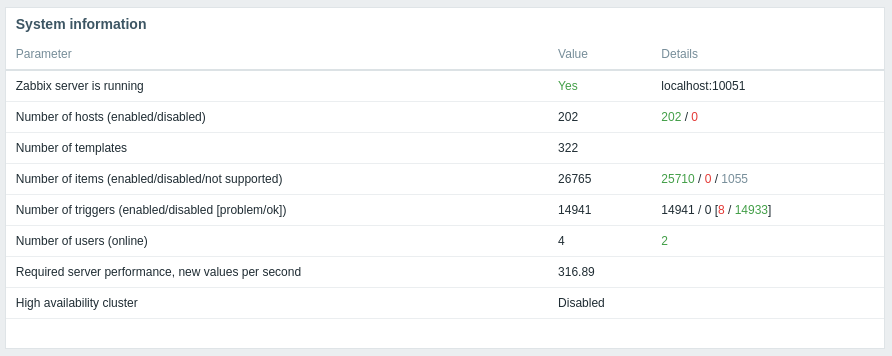

# monitoring lab computers and servers with zabbix and grafana

We have around 20 servers, 150 lab computers, 10 printers, and a network
switch. We would like to create *status dashboards* to easily show the
current status of our systems. These dashboards should be accessible by the
sysadmins as well as the students and faculty. Ideally, the dashboards
will help the sysadmins discover and diagnose problems, and help the
students and faculty to better utilize the department resources.

Here are two quick examples of the dashboards we will create:


The above shows CPU load vs. time for all of our lab computers and
servers. The next dashboard below shows *uptimes* with color thresholds
to highlight short uptimes:


All of the above panels include a link at the top left to 
a more detailed dashboard status page for that specific computer, 
like this:


We will use [zabbix](https://www.zabbix.com/manuals) to gather 
the data from the lab computers and servers, and
[grafana](https://grafana.com/) to turn the gathered data into
useful dashboards.

Note: as of June 2021, this works for Zabbix v5.4 and Grafana v8.0.3
(on Debian 10).

Note: updating this page in September 2022. Trying Zabbix v6.2.3 and Grafana v9.2.1
(on Debian 11).

## install zabbix

### preliminaries

For our install (updated Fall 2022) we used debian bullseye on a virtual
machine for the zabbix server, running version 6.2 of zabbix. Both zabbix
and grafana run on the same server.

Here's the Zabbix System Information panel to show how many things
(hosts, items, etc) we are monitoring:



For our virtual machine, we are using qemu-kvm, also running on a debian
host server. The kvm host server has 64GB of memory and 8 CPU
cores, and runs a few other virtual machines for us.

For the actual zabbix server, our virtual machine has 64GB of memory,
4 virtual CPUs, and 64GB of disk space. The memory is probably a little
over-provisioned, but I depend on this server to see what's going on with
all of my other servers, so I need it to run well. Here's the output
from the `top` command (after everything is working):

```
top - 10:05:57 up 28 days, 22:44,  2 users,  load average: 0.34, 0.50, 0.58
Tasks: 172 total,   1 running, 170 sleeping,   0 stopped,   1 zombie
%Cpu0  :  0.9 us,  6.3 sy,  0.0 ni, 91.0 id,  0.9 wa,  0.0 hi,  0.9 si,  0.0 st
%Cpu1  :  1.8 us, 10.0 sy,  0.0 ni, 84.5 id,  3.6 wa,  0.0 hi,  0.0 si,  0.0 st
%Cpu2  :  3.7 us,  3.7 sy,  0.0 ni, 85.3 id,  1.8 wa,  0.0 hi,  5.5 si,  0.0 st
%Cpu3  :  2.8 us,  5.5 sy,  0.0 ni, 89.0 id,  0.0 wa,  0.0 hi,  2.8 si,  0.0 st
MiB Mem :  64320.8 total,  44076.7 free,   2047.7 used,  18196.4 buff/cache
MiB Swap:   2048.0 total,   2048.0 free,      0.0 used.  61466.6 avail Mem
```

And our disk space currently looks like this:

```
$ df -h
Filesystem      Size  Used Avail Use% Mounted on
/dev/sda1        57G   16G   39G  29% /
/dev/sda4       7.8G  3.2G  4.2G  44% /usr
/dev/sda3       574M  268K  562M   1% /tmp
```

Of the 16GB used so far in `/`, almost all of that is in `/var/lib/mysql` where
the data is stored (and on a past server this went up to 32GB over time).

Note: for debian kvm hosts, see the
[Libvirt Wiki](https://wiki.libvirt.org/page/Virtio)
if your host network interface is only 100Mbps (change to using the `virtio` interface).
For example, on my kvmhost, after I had installed the kvmguest, I shut it down
and then edited the kvmguest file, changing the `e1000` network driver to `virtio`:

```
$ ssh kvmhost
kvmhost$ sudo virsh shutdown kvmguest
kvmhost$ sudo virsh edit kvmguest
    <interface type='bridge'>
      <mac address='52:54:00:00:00:3a'/>
      <source bridge='br0'/>
      <model type='e1000'/>
      <address type='pci' domain='0x0000' bus='0x00' slot='0x03' function='0x0'/>
    </interface>
#### change to ####
    <interface type='bridge'>
      <mac address='52:54:00:00:00:3a'/>
      <source bridge='br0'/>
      <model type='virtio'/>
      <address type='pci' domain='0x0000' bus='0x00' slot='0x03' function='0x0'/>
    </interface>
kvmhost$ sudo virsh start kvmguest
```

### install details

Both zabbix (v6.2) and grafana were installed from their respective
repositories. See below for pages to follow.

#### install zabbix and mysql

Follow this page for install and configuration:
[https://www.zabbix.com/download?zabbix=6.2&os_distribution=debian&os_version=10_buster&db=mysql](https://www.zabbix.com/download?zabbix=6.2&os_distribution=debian&os_version=10_buster&db=mysql)

Note: for the above, after installing (step b) but before creating the 
mysql database (step c), I followed this page on making mysql a little
more secure:

[https://www.digitalocean.com/community/tutorials/how-to-install-mariadb-on-debian-10](https://www.digitalocean.com/community/tutorials/how-to-install-mariadb-on-debian-10)

From the above digitalocean page:

```
$ sudo mysql_secure_installation

Enter current password for root (enter for none):

Switch to unix_socket authentication [Y/n] n

Change the root password? [Y/n] n

Remove anonymous users? [Y/n] y

Disallow root login remotely? [Y/n] y

Remove test database and access to it? [Y/n] y

Reload privilege tables now? [Y/n] y

Thanks for using MariaDB!

```

Now test it and make an admin account:

```
$ sudo mysql
Welcome to the MariaDB monitor.  Commands end with ; or \g.
Your MariaDB connection id is 36
Server version: 10.5.15-MariaDB-0+deb11u1 Debian 11

Copyright (c) 2000, 2018, Oracle, MariaDB Corporation Ab and others.

Type 'help;' or '\h' for help. Type '\c' to clear the current input statement.

MariaDB [(none)]> GRANT ALL ON *.* TO 'admin'@'localhost' IDENTIFIED BY 'useGoodpwHere' WITH GRANT OPTION;
Query OK, 0 rows affected (0.004 sec)

MariaDB [(none)]> flush privileges;
Query OK, 0 rows affected (0.001 sec)

MariaDB [(none)]> exit
Bye


$  sudo systemctl status mariadb
$  sudo mysqladmin version
$  mysqladmin -u admin -p version
```

The last two *version* commands should show the same info.

After running the `mysql_secure_installation` script I then went back
to the zabbix install page and did steps c, d, and e.

Here's a cleaned up example of step c from my zabbix install:

```
$ sudo mysql -uroot -p
Enter password:
Welcome to the MariaDB monitor.  Commands end with ; or \g.
Server version: 10.5.15-MariaDB-0+deb11u1 Debian 11

MariaDB [(none)]> create database zabbix character set utf8mb4 collate utf8mb4_bin;
Query OK, 1 row affected (0.001 sec)

MariaDB [(none)]> create user zabbix@localhost identified by 'not a good pw';
Query OK, 0 rows affected (0.007 sec)

MariaDB [(none)]> grant all privileges on zabbix.* to zabbix@localhost;
Query OK, 0 rows affected (0.004 sec)

MariaDB [(none)]> set global log_bin_trust_function_creators = 1;
Query OK, 0 rows affected (0.000 sec)

MariaDB [(none)]> quit;
Bye

$ sudo su
root# zcat /usr/share/doc/zabbix-sql-scripts/mysql/server.sql.gz | mysql --default-character-set=utf8mb4 -uzabbix -p zabbix
Enter password: not a good pw
(this part takes 20-40 seconds)
root# exit
$ sudo mysql -uroot -p
Enter password:
Welcome to the MariaDB monitor.  Commands end with ; or \g.

MariaDB [(none)]> set global log_bin_trust_function_creators = 0;
Query OK, 0 rows affected (0.001 sec)

MariaDB [(none)]> quit;
Bye
```

Note: for the mysql password for the zabbix user, if you make 
the password (in step c) 'passwords are cool', then in `zabbix_server.conf` (step d)
you can put the password in without quotes: `DBPassword=passwords are cool`

At this point you can also change some config options for zabbix,
but **don't start zabbix until you do the certbot/letsencrypt stuff
below** (so login and passwd are encrypted). 

For the number of hosts
we have, I have to increase some cache sizes, otherwise zabbix complains.
Here are the options I changed in the zabbix config file:

```
$ sudo grep -v ^# /etc/zabbix/zabbix_server.conf | sort | uniq
CacheSize=96M
DBPassword=not a good pw
ValueCacheSize=64M
...
...
```

#### install apache and certbot/letsencrypt

Make sure your firewall allows http and https to your zabbix server,
then add the certbot packages and apache, and get your SSL cert set up.

Add the packages:

```bash
sudo apt-get update
sudo apt-get install apache2 certbot python-certbot-apache 
```

Configure certbot for apache:

```
$ sudo certbot --apache
Enter email address (used for urgent renewal and security notices)
 (Enter 'c' to cancel): myusername@cs.college.edu

- - - - - - - - - - - - - - - - - - - - - - - - - - - - - - - - - - - - - - - -
Please read the Terms of Service at
https://letsencrypt.org/documents/LE-SA-v1.3-September-21-2022.pdf. You must
agree in order to register with the ACME server. Do you agree?
- - - - - - - - - - - - - - - - - - - - - - - - - - - - - - - - - - - - - - - -
(Y)es/(N)o: y

- - - - - - - - - - - - - - - - - - - - - - - - - - - - - - - - - - - - - - - -
Would you be willing, once your first certificate is successfully issued, to
share your email address with the Electronic Frontier Foundation, a founding
partner of the Let's Encrypt project and the non-profit organization that
develops Certbot? We'd like to send you email about our work encrypting the web,
EFF news, campaigns, and ways to support digital freedom.
- - - - - - - - - - - - - - - - - - - - - - - - - - - - - - - - - - - - - - - -
(Y)es/(N)o: y
Account registered.
No names were found in your configuration files. Please enter in your domain
name(s) (comma and/or space separated)  (Enter 'c' to cancel): myvm.cs.college.edu
Requesting a certificate for myvm.cs.college.edu
Performing the following challenges:
http-01 challenge for myvm.cs.college.edu
Enabled Apache rewrite module
Waiting for verification...
Cleaning up challenges
Created an SSL vhost at /etc/apache2/sites-available/000-default-le-ssl.conf
Enabled Apache socache_shmcb module
Enabled Apache ssl module
Deploying Certificate to VirtualHost /etc/apache2/sites-available/000-default-le-ssl.conf
Enabling available site: /etc/apache2/sites-available/000-default-le-ssl.conf
Enabled Apache rewrite module
Redirecting vhost in /etc/apache2/sites-enabled/000-default.conf to ssl vhost in /etc/apache2/sites-available/000-default-le-ssl.conf

- - - - - - - - - - - - - - - - - - - - - - - - - - - - - - - - - - - - - - - -
Congratulations! You have successfully enabled https://myvm.cs.college.edu
- - - - - - - - - - - - - - - - - - - - - - - - - - - - - - - - - - - - - - - -
$

```

Enable some modules for apache, and make sure it knows what to
do when users go to https://myvm.cs.college.edu/grafana:

```
$ sudo a2enmod proxy proxy_http
Enabling module proxy.
Enabling module proxy_http.
To activate the new configuration, you need to run:
  systemctl restart apache2

$ sudo vim /etc/apache2/sites-enabled/000-default-le-ssl.conf
(added/changed these)
        ServerName www.example.com
        ServerAdmin webmaster@www.example.com

        ProxyRequests Off
        ProxyPreserveHost On
        ProxyPass /grafana http://localhost:3000
        ProxyPassReverse /grafana http://localhost:3000

$ sudo systemctl restart apache2.service
```

#### configure zabbix front end

Once you have https working, you can configure the zabbix frontend.

Follow this page for frontend install and config:
[https://www.zabbix.com/documentation/current/manual/installation/frontend](https://www.zabbix.com/documentation/current/manual/installation/frontend)

- pick the default language
- check that all of the PHP stuff shows up as OK and green
- set the db connection user and password (zabbix and whatever you set DBPassword to)
- pick the time zone
- click Finish

*Finally*, you should be at the login screen for the zabbix web interface
It should also be using https! Log in with the defaults (Admin, zabbix) and
then change them.

On first login here's what I did:

- changed the Admin password from `zabbix` to something better (Administration -> Users,
  then click on Admin user and click on Change password)
- added users (blue `Create user` user button at top right
  of Administration -> Users page) with Group equal to Zabbix admin group and with 
  permissions/role (have to click on Permissions tab) equal to "super admin"
- disabled the Admin user (and guest) *after* successful login as myself
- set up media: 
  * Email to use our own mail server 
  * disabled most other media

---

Also NOTE, as mentioned above...after adding a few hosts (> 20) I had to 
change the `CacheSize=64M` in `/etc/zabbix/zabbix_server.conf` (it was
originally set to 8M).

---

#### additional packages on server

Some additional packages installed on the zabbix server:

- bind9-host
- mariadb-client
- nmap
- tmux
- zsh
- python3-pip
- software-properties-common
- zabbix-get

Also used `pip3` (as a normal user) to install some python packages, 
which we will use when we add hosts to zabbix.

    pip3 install pyzabbix
    pip3 install click
    pip3 install mysql-connector-python
    pip3 install grafanalib

- pyzabbix: [https://github.com/lukecyca/pyzabbix](https://github.com/lukecyca/pyzabbix)
- click: [https://palletsprojects.com/p/click/](https://palletsprojects.com/p/click/)

#### additional agent configs

In `zabbix_agentd.conf`, if you want to write and run your own commands 
on your lab computers, you may need to _enable remote commands_:

    EnableRemoteCommands=1

NOTE: I think this is now deprecated, and should be:

    AllowKey=system.run[*]

You also may need to set the `Server` variables:

    Server=127.0.0.1,1.2.3.4          # change 1.2.3.4 to your
    ServerActive=127.0.0.1,1.2.3.4    # zabbix server IP


At this point you can start zabbix!

```
systemctl start zabbix-server
```

### zabbix adding hosts and items

#### make Host groups

Configuration -> Host groups -> Create host group (blue button top right)

These host groups are just "logical groups" that are used for filtering.
Initially create a bunch of empty groups, however you want to group
your computers. Then (below) we will add computers to zabbix and populate
the groups.

For example, I created a group for each lab (room) we have (e.g., Lab_238, Lab_240, etc), 
as well as a group for servers, virtual machines, 
printers, special computers (with good GPUs), and networking equipment.

#### adding Hosts

Here's what we want to do: add all hosts in a lab to zabbix, in certain
host groups (created above), with certain templates (that either come with
zabbix or are added to it). The details are explained below.

```bash
$ ./addZabbixHosts.py -f /usr/swat/db/hosts.overflow -g "Lab_238" -g "SwatCSComputers" -t "Linux by Zabbix agent" -t "SSH Service" -t "ICMP Ping"
Creating cayenne in zabbix...
Creating coconut in zabbix...
Creating egg in zabbix...
Creating horseradish in zabbix...
Creating lavender in zabbix...
Creating marjoram in zabbix...
Creating molasses in zabbix...
Creating olive in zabbix...
Creating orange in zabbix...
Creating perilla in zabbix...
Creating sumac in zabbix...
Creating tamarind in zabbix...
```

We are a small computer science department that has labs of
10-30 computers in the building and around campus. When adding hosts to
zabbix, we wanted to group the hosts/computers by lab/room number, to
better keep track of the status of computers in each lab.  

All information about any one computer (e.g., name, IP address, room
number, etc) is stored in ansible, in that computer's `host_vars` file.
With this data in ansible, we can generate lists of computers in each
lab. For example, a `hosts.256` file contains the names of all computers in room 256.

With these "hosts" files, and using `pyzabbix`, we can add hosts to
zabbix, using Group names relating to each lab. For example, all
computers in our `hosts.256` file would be added to zabbix in the
`Lab_256` group.

In the `zabbix` directory of this repo we include our `addZabbixHosts.py` program to add
hosts to zabbix, given a Group and a Template. You can even include more
than one group and more than one template, if you want.

Here's an example of using `addZabbixHosts.py` to add to zabbix all computers 
in the file `hosts.256`, to the `Lab_256` group, using the "Linux by Zabbix agent" 
template (comes with zabbix, and the zabbix host groups must already
exist in zabbix):

    ./addZabbixHosts.py -f hosts.256 -g Lab_256 -t "Linux by Zabbix agent"

The `addZabbixHosts.py` script expects a `~/zabbixAuth` file with your
zabbix user credentials in it:

```
$ cat ~/zabbixAuth
https://yourserver.edu/zabbix
zabbix_user_you_created
zabbix_user_password
```
For all of our linux lab computers and servers, we use the default
templates that come with zabbix:

- Linux by Zabbix agent
- SSH Service
- ICMP Ping

**We also install the zabbix-agent on all computers we want to monitor**.
So all lab computers run zabbix-agent, and allow the zabbix server to 
monitor them.
Here's the relevant part of our config file for the zabbix agent
on each lab machine:

    $ grep -v ^# /etc/zabbix/zabbix_agentd.conf | sort | uniq
    EnableRemoteCommands=1        # now AllowKey=system.run[*] ??
    Server=1.2.3.4                # put your zabbix server ip here
    ServerActive=1.2.3.4          # and here

At this point we have zabbix running on a server and gathering data 
from all of our servers and lab computers. You can create or import
other templates if needed.

Zabbix can also make it's own graphs and dashboards. Below is an overview
dashboard with problems and some host graphs and data. See the grafana
install info below for a better way to make pretty dashboards.


## install grafana

Add the grafana repo:

```bash
$ cat /etc/apt/sources.list.d/grafana.list
deb https://packages.grafana.com/oss/deb stable main
```

Then add some extra packages (may already be installed) and the repo key:

```bash
sudo apt-get install -y apt-transport-https
sudo apt-get install -y software-properties-common wget
wget -q -O - https://packages.grafana.com/gpg.key | sudo apt-key add -
```

And install the software:

```bash
sudo apt-get update
sudo apt-get install grafana
```

Here's what mine looked like:

```
  $ sudo apt-get install grafana
Reading package lists... Done
Building dependency tree... Done
Reading state information... Done
The following NEW packages will be installed:
  grafana
0 upgraded, 1 newly installed, 0 to remove and 6 not upgraded.
Need to get 81.2 MB of archives.
After this operation, 275 MB of additional disk space will be used.
Get:1 https://packages.grafana.com/oss/deb stable/main amd64 grafana amd64 9.1.6 [81.2 MB]
Fetched 81.2 MB in 3s (24.5 MB/s)
Selecting previously unselected package grafana.
(Reading database ... 68741 files and directories currently installed.)
Preparing to unpack .../grafana_9.1.6_amd64.deb ...
Unpacking grafana (9.1.6) ...
Setting up grafana (9.1.6) ...
Adding system user `grafana' (UID 115) ...
Adding new user `grafana' (UID 115) with group `grafana' ...
Not creating home directory `/usr/share/grafana'.
### NOT starting on installation, please execute the following statements to configure grafana to start automatically using systemd
 sudo /bin/systemctl daemon-reload
 sudo /bin/systemctl enable grafana-server
### You can start grafana-server by executing
 sudo /bin/systemctl start grafana-server
```

### configure grafana and apache

First set up apache so you can get to `http://localhost:3000`, which
is where grafana is. NOTE: some of this apache config stuff was mentioned
above, so you may have already done some of this...

Add the proxy modules to apache:

```bash
sudo a2enmod proxy proxy_http
```

Now add the Proxy directives to your apache enabled site:

```bash
$ cat /etc/apache2/sites-enabled/000-default-le-ssl.conf
<IfModule mod_ssl.c>
<VirtualHost *:443>
        ServerName www.example.com
        ServerAdmin webmaster@www.example.com
        DocumentRoot /var/www/html

        ErrorLog ${APACHE_LOG_DIR}/error.log
        CustomLog ${APACHE_LOG_DIR}/access.log combined

        ProxyRequests Off
        ProxyPreserveHost On
        ProxyPass /grafana http://localhost:3000
        ProxyPassReverse /grafana http://localhost:3000

SSLCertificateFile /etc/letsencrypt/live/www.example.com/fullchain.pem
SSLCertificateKeyFile /etc/letsencrypt/live/www.example.com/privkey.pem
Include /etc/letsencrypt/options-ssl-apache.conf
</VirtualHost>
</IfModule>
```

And restart apache:

```bash
sudo systemctl restart apache2
```

Also need to change some grafana configs to work with apache/proxy.
Here are the changes I made to `/etc/grafana/grafana.ini` to get this
to work (also see further down where I change more grafana configs):

```bash
[server]
root_url = %(protocol)s://%(domain)s:%(http_port)s/grafana
serve_from_sub_path = true

[users]
allow_sign_up = false
allow_org_create = false
auto_assign_org_role = Viewer

[auth.proxy]
enabled = true
```

And restart grafana:

```bash
sudo systemctl restart grafana-server
```

### login to grafana, add zabbix datasource

At this point you should be able to login to grafana with the
default admin/admin account. You should/must change that password
(might have to do this from the `ServerAdmin -> Users` section). 
Once you've done that we need to add zabbix as a datasource.

Use the grafana-cli command in a terminal to add it (and others
you might want) and restart grafana again:

```bash
sudo grafana-cli plugins install alexanderzobnin-zabbix-app
sudo grafana-cli plugins install grafana-clock-panel
sudo grafana-cli plugins install grafana-polystat-panel
sudo systemctl restart grafana-server
```

After installing the zabbix plugin, you still need to configure it.
Follow the 
[zabbix plugin config page](https://alexanderzobnin.github.io/grafana-zabbix/configuration/).

Notes: 

- I did *not* do a direct connection to the db 
- I *did* use the Zabbix API with a new zabbix account (called grafana) and password (go back to zabbix,
add a new user (called grafana), set their role to "Super admin")
- my url: `http://localhost/zabbix/api_jsonrpc.php`
- Also make sure you "clear your browser cache" (see the note 
at the bottom of the
[zabbix plugin config page](https://alexanderzobnin.github.io/grafana-zabbix/configuration/))

And sometimes it takes a few minutes before grafana pulls in data
from zabbix. Take your time when you create a new dashboard and 
try to add data from zabbix to a graph.

At this point you should be able to make dashboards with data from zabbix.

## setting up dashboards

Rather than creating dashboards by hand, we wrote some scripts that
use the [zabbix API](https://www.zabbix.com/documentation/current/manual/api)
and a grafana token to create one dashboard with data from all of our lab 
computers. Here's an example of our "uptimes" dashboard:


You can create similar dashboards for other metrics (CPU, memory, network traffic),
for all computers, making it easy to see at a glance if any computers are down or
under heavy load.

These scripts were originally created by 
[Herbie Rand](https://github.com/hrand1005) using his
[grafapyAPI repo](https://github.com/hrand1005/grafapyAPI).

I have streamlined a few of these and put them in the `dashboards` directory.
For example, running `singelStatUptimes.py` should create the above
uptimes dashboard for all zabbix hosts in the `DEFAULTGROUP` group 
(see `utils.py` to change that group).

**To run the scripts you will need to create a grafana token**. 
In the grafana web interface,
go to `Configuration -> API Keys` and click the "New API key" button. Give it
a name, select Admin role, click Add. Now copy the long
string it shows and put it in a `~/grafanaToken` file if you want to use these
dashboard scripts. The full `~/grafanaToken` format should look like this:

```bash
$ cat ~/grafanaToken
a really long string that you should replace with your grafana token....
http://localhost:3000
```

Also note: I think grafana is moving away from the API key and replacing
it with "Service Accounts", but they seem to do the exact same thing...

## guest access 

Finally, I want my sysadmins to be able to log in to grafana and change 
things, but I also want my faculty and students to be able to *view* all
dashboards (without logging in), so they can see if computers are up or
which computers are busy.

Here are the changes to `/etc/grafana/grafana.ini` to allow *guest* access
(and a few other things, like serving from `/grafana`):

```
[server]
root_url = %(protocol)s://%(domain)s:%(http_port)s/grafana
serve_from_sub_path = true

[security]
disable_gravatar = true

[dashboards]
versions_to_keep = 10

[users]
allow_sign_up = false
allow_org_create = false
auto_assign_org_role = Viewer

[auth.anonymous]
enabled = true
org_name = SwatCS
org_role = Viewer
hide_version = true

[auth.proxy]
enabled = true
auto_sign_up = false

[auth.jwt]
enabled = false
```
